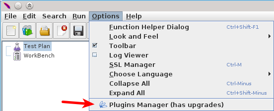
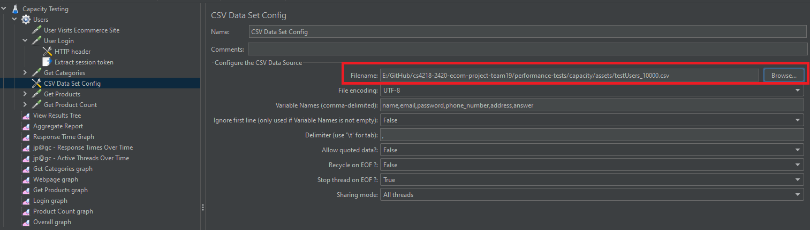
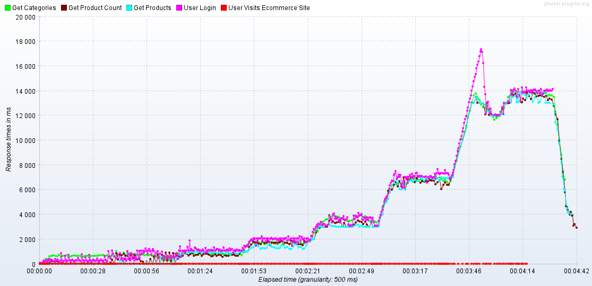
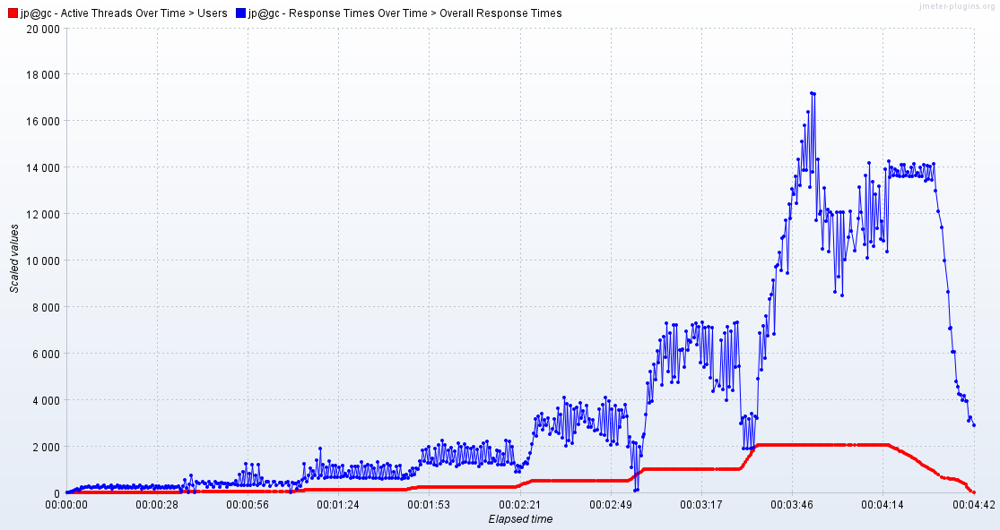

# How to setup JMeter for this test
Make sure you have the Plugins Manager for JMeter downloaded and installed. If you do not, visit [this website](https://jmeter-plugins.org/wiki/PluginsManager/) to download it. After that, place it into JMeter's `lib/ext` folder. After restarting JMeter, you should be able to see the Plugins Manager in the Options menu.

Image from [https://jmeter-plugins.org/wiki/PluginsManager/](https://jmeter-plugins.org/wiki/PluginsManager/).

You will need to add the Custom Thread Groups plugin for this, as it is dependent on the Ultiamte Thread Groups plugin.

# How to setup DB environment for this test
Import the CSV file: `performance-tests\capacity\assets\testUsers_10000_hashed.csv` to the Users collection in MongoDB.

# How to run the test
Make sure you run `npm run dev` to run the server.

Make sure you have MongoDB connected.

After opening the `.jmx` file, set the Filename for CSV Dataset Config to the CSV file: `performance-tests\capacity\assets\testUsers_10000.csv`.

Run the test by pressing the start button.

# Results

The performance testing results from the JMeter capacity test reveal how the system responds under increasing user load. We aim to find the capacity limits of the system—specifically, the point at which the response time exceeds acceptable thresholds. This type of testing helps identify the “safety zone”, or the maximum number of concurrent users the system can support without significantly degrading user experience.

Initially, during the first two minutes of the test, response times for all endpoints—such as Get Categories, Get Products, and User Login—remain low and stable. This indicates that the system performs well under light to moderate traffic conditions, handling up to 128 concurrent users without significant delay.

As the number of users increases beyond this point, response times begin to rise. Around the 3-minute mark, the load ramps up significantly to 256, then 512, and eventually 1024 users. Correspondingly, response times also increase, especially for the User Login endpoint, which peaks at nearly 18 seconds. This suggests that the system is reaching its capacity threshold, where performance starts to degrade beyond an acceptable level.

Despite the high load, the system demonstrates resilience. After the peak user load is removed toward the end of the test, the response times drop sharply, showing that the application recovers well once stress is reduced. This is a good sign of reliability, as it indicates the system doesn't remain slow or unstable after a period of heavy use.

In summary, this capacity testing confirms that the system can operate efficiently up to around 256–512 users. Beyond that, response times spike sharply, especially for login functionality, indicating that further optimization or scaling is necessary. The results help define the upper bounds of the system's performance before user experience is compromised.